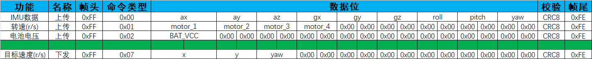

# GCXL2024

This is the repository for GCXL2024 belonging to the **SAU** team.

## CV Part

### model training

The Train Part is based on [OpenMMLab MMYOLO](https://github.com/open-mmlab/mmyolo).

Train code is in `src/train_model` with full documents.
The training config file is in `src/train_model/yolov5/train_config.py`.Datasets can be downloaded
from [Baidu Netdisk](https://pan.baidu.com/s/1NcQSzuD8DhYUe0tgpDfh5Q?pwd=gcxl)

### object detection

### landmark detection

### edge detection

## Chassis Part

### Current Status

### Communication Protocol

### ESP32 UDP Remote Control

[ESP32-README](src/ESP32/README.md)

    ESP32_TXD GPIO_NUM_4
    ESP32_RXD GPIO_NUM_5
    BAUD_RATE 115200
    UDP PORT 3333

Connect to the RoboMaster-C via UART1(USART6 in STM32).

### Progress
ESP32 WIFI UDP remote control is established. 2024/09/15

Communication with the upper computer is established via USART6, and the upper computer can control the
chassis speed by sending commands. 2024/09/13

Implement the PID control for the speed loop. 2024/09/12

## Robotic Arm Part
Not developed yet.